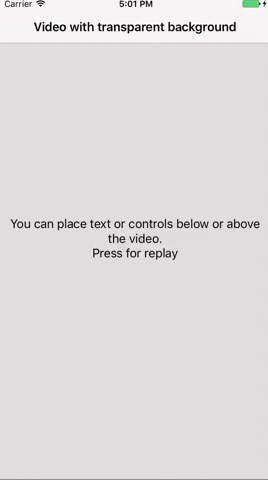

# VideoTransparentBackground

Sample project displaying a video with transparent background in iOS app. Read relevant article: [https://andreygordeev.com/2017/07/01/video-with-transparent-background-ios/](2017/07/01/video-with-transparent-background-ios/). 

Written on Swift.

## Author

[Andrey Gordeev](https//andreygordeev.com)

## License

This project is under MIT license. For more information, see `LICENSE` file.
